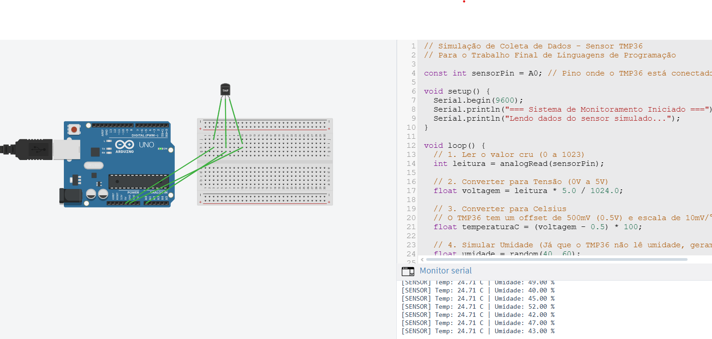

# Análise de Estruturas de Dados para Sensores de Temperatura

**Curso:** Linguagens de Programação - Engenharia de Controle e Automação (UFRJ)  
**Autores:** João Pedro Leite Bizoni, David Ferreira, Arthur Siqueira  
**Data:** 08/12/2025

---

## 1. Resumo
Este projeto implementa e compara três abordagens para armazenamento e consulta de dados de sensores de temperatura industriais: uma **Lista Encadeada Ordenada** (Insertion Sort), uma **Árvore Binária de Busca Rubro-Negra** e uma **Heap**. O objetivo é analisar a escalabilidade de cada método conforme o volume de dados cresce, visando substituir um sistema legado ineficiente.

## 2. Descrição do Problema e Solução
O sistema atual da empresa, baseado em listas simples, apresenta lentidão crítica em consultas com alto volume de sensores (gargalo de escalabilidade). Para resolver isso, propomos a comparação entre manter a lista ordenada na inserção versus utilizar estruturas hierárquicas (Árvore e Heap) para otimizar as buscas e inserções em tempo real.

## 3. Descrição Técnica

### Abordagem 1: Lista Encadeada Ordenada (Insertion Sort)
Mantém os dados sempre ordenados no momento da inserção. Embora facilite a busca visual, possui alto custo computacional para inserir novos dados em grandes volumes, pois exige o deslocamento lógico dos elementos.
* **Complexidade Inserção:** $O(N)$ (Linear).
* **Complexidade Busca Máximo:** $O(1)$ (Como está ordenada, é o último elemento).

### Abordagem 2: Árvore Rubro-Negra (Red-Black Tree)
Uma árvore binária de busca balanceada. Garante que a altura da árvore seja sempre logarítmica, impedindo a degradação de performance (worst-case) mesmo com dados inseridos sequencialmente.
* **Complexidade Inserção:** $O(\log N)$ (Logarítmica - muito rápida).
* **Complexidade Busca Máximo:** $O(\log N)$ (Percorre até a extrema direita).

### Abordagem 3: Max-Heap
Estrutura baseada em vetor, otimizada para manter o maior elemento sempre no topo. Ideal para sistemas de alerta de temperatura crítica.
* **Complexidade Inserção:** $O(\log N)$.
* **Complexidade Busca Máximo:** $O(1)$ (Instantânea - acesso direto à raiz).

## 4. Metodologia de Comparação
* **Hardware e Ambiente:** Testes realizados em ambiente Windows utilizando compilador MinGW (g++).
* **Métricas:** Tempo de inserção (em microssegundos - $\mu s$) e tempo de busca do valor máximo (em nanossegundos - $ns$).
* **Volume de Dados:** Testes de carga com N = 100, 1.000, 10.000, 20.000 e 50.000 leituras simuladas.
* **Controle de Otimização:** Utilizou-se variáveis voláteis e impressão de tamanho (`getSize`) para evitar que o compilador eliminasse a execução das estruturas mais rápidas (Dead Code Elimination).

## 5. Resultados Experimentais

Os testes revelaram uma diferença massiva de desempenho. Enquanto a Lista degradou rapidamente, a Árvore e a Heap mantiveram tempos abaixo da resolução do relógio do sistema para a maioria dos casos.

### Tabela de Tempos (Dados Coletados)

| N (Leituras) | Inserção Lista (ns) | Inserção Árvore (ns) | Inserção Heap (ns) |
| :--- | :--- | :--- | :--- |
| 1.000 | ~9.494.000 (9ms) | < 15.000 (0*) | < 15.000 (0*) |
| 10.000 | ~71.987.000 (71ms) | < 15.000 (0*) | ~16.000.000 (16ms) |
| **50.000** | **~2.728.301.000 (2.7s)** | **< 15.000 (0*)** | **< 15.000 (0*)** |

*\*Nota: Valores marcados como 0 ns indicam que a operação foi tão rápida que ficou abaixo da resolução mínima do relógio do sistema operacional (< 15ms), comprovando a extrema eficiência das estruturas logarítmicas.*

### Gráficos
, Arvore (ns) e Heap (ns).png)
*Figura 1: Comparativo de Inserção (Recomenda-se escala logarítmica).*

, Arvore Busca (ns) e Heap Busca (ns).png)
*Figura 2: Comparativo de Busca de Máximo.*

**Análise:** A Lista Encadeada demonstrou crescimento quadrático ($O(N^2)$), tornando-se inviável para $N > 20.000$. A Árvore Rubro-Negra e a Heap mantiveram tempos de resposta virtualmente instantâneos, validando sua aplicabilidade para o cenário proposto pela empresa.

## 6. Organização do Código
O projeto foi modularizado para separar a lógica das estruturas da interface de teste.

* `src/main.cpp`: Ponto de entrada, executa a bateria de testes e gera a tabela.
* `src/SensorData.h`: Definição da estrutura de dados (Temperatura/Umidade).
* `src/LinkedList.cpp` e `.h`: Implementação da Lista Ordenada.
* `src/RBTree.cpp` e `.h`: Implementação da Árvore Rubro-Negra.
* `src/SensorHeap.cpp` e `.h`: Implementação da Heap.
* `src/DHTSim.h`: Simulador de dados do sensor.
* `arduino/sensor_dht.ino`: Código para hardware real (Bônus).

### Como rodar
Certifique-se de ter o compilador g++ instalado e configurado no Path.
1. Compile o projeto:
   ```bash
   g++ src/*.cpp -o trabalho_final
2. Execute:
   .\trabalho_final.exe

## 7. Bônus Implementados

### 7.1 Integração com Tinkercad (Simulação de Hardware)
Para demonstrar a coleta de dados na borda (Edge Computing), foi criada uma simulação no Tinkercad utilizando um Arduino Uno e um sensor de temperatura.

* **Arquitetura:** O Arduino lê o sensor analógico e envia os dados formatados via Serial, simulando a entrada de dados que o programa C++ processaria.
* **Link para Simulação:** [🟢 Clique aqui para acessar o projeto no Tinkercad](https://www.tinkercad.com/things/2HZfCiHLFXf-dhttblp)


*(Print da simulação em funcionamento)*

### 7.2 Outros Bônus
* [x] **Implementar mais de uma estrutura:** Além da Rubro-Negra, foi implementada uma **Max-Heap**.
* [x] **Análise Experimental:** Uso de cronômetros de alta precisão (`std::chrono::nanoseconds`).

## 8. Uso de IA generativa
    Este README, a estruturação do código e a correção de bugs de compilação foram desenvolvidos com o auxílio do Gemini e do Github Copilot, garantindo conformidade com os requisitos de documentação técnica e boas práticas de C++.

## 9. Referências
    CORMEN, T. H. et al. Introduction to Algorithms.
    Material de aula - Prof. Claudio Miceli (UFRJ).